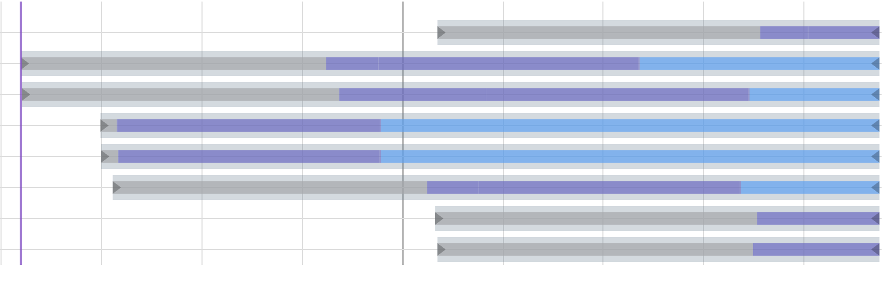
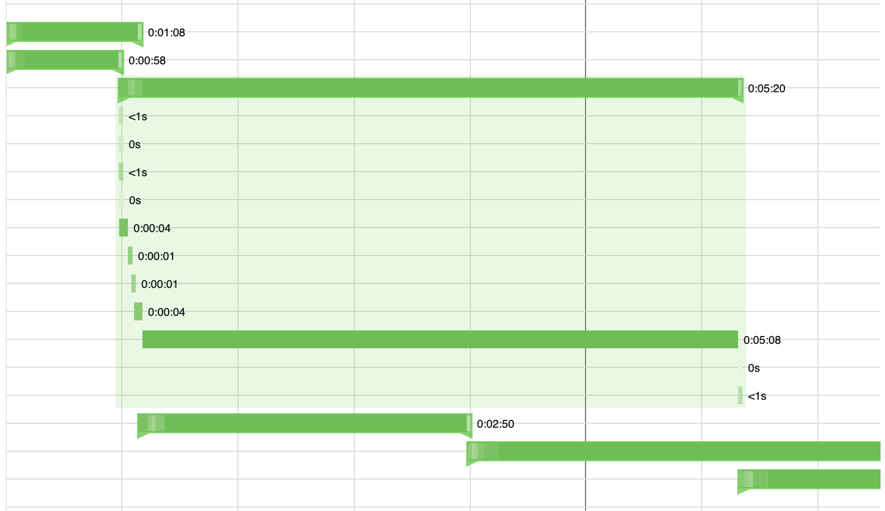

# @gravity-ui/timeline [](https://www.npmjs.com/package/@gravity-ui/timeline) [](https://github.com/gravity-ui/timeline/actions/workflows/release.yml?query=branch:main) [](https://preview.gravity-ui.com/timeline/)

> [English](./README.md)

React-библиотека для построения интерактивных временных шкал с рендерингом на canvas.

## Документация

Подробности см. в [Документации](./docs/docs.md).

## Превью

Базовая шкала с событиями и осями:



Кастомный вариант с раскрывающимися вложенными событиями (пример [NestedEvents](https://preview.gravity-ui.com/timeline/?path=/story/integrations-gravity-ui--nested-events-story)):



## Возможности

- Рендеринг на canvas для высокой производительности
- Интерактивная шкала с масштабированием и панорамированием
- Поддержка событий, маркеров, секций, осей и сетки
- Фоновые секции для визуальной организации и выделения периодов
- Умная группировка маркеров с автоматическим зумом по группе — клик по сгруппированным маркерам приближает их по отдельности
- Виртуализированный рендеринг для больших наборов данных (включается, когда содержимое шкалы выходит за пределы видимой области)
- Настраиваемый внешний вид и поведение
- Поддержка TypeScript с полными типами
- Интеграция с React и кастомными хуками

## Установка

```bash
npm install @gravity-ui/timeline
```

## Использование

Компонент временной шкалы можно использовать в React-приложениях с такой базовой настройкой:

```tsx
import { TimelineCanvas, useTimeline } from '@gravity-ui/timeline/react';

const MyTimelineComponent = () => {
  const { timeline, api, start, stop } = useTimeline({
    settings: {
      start: Date.now(),
      end: Date.now() + 3600000, // через 1 час
      axes: [],
      events: [],
      markers: [],
      sections: []
    },
    viewConfiguration: {
      // Опциональная конфигурация вида
    }
  });

  // timeline — экземпляр Timeline
  // api — экземпляр CanvasApi (то же, что timeline.api)
  // start — функция инициализации шкалы с canvas
  // stop — функция уничтожения шкалы

  return (
    <div style={{ width: '100%', height: '100%' }}>
      <TimelineCanvas timeline={timeline} />
    </div>
  );
};
```

### Структура оси

Каждая ось задаётся так:

```typescript
type TimelineAxis = {
  id: string;          // Уникальный идентификатор оси
  tracksCount: number; // Количество треков на оси
  top: number;         // Вертикальная позиция (px)
  height: number;      // Высота одного трека (px)
};
```

### Структура секции

Каждая секция должна иметь такую структуру:

```typescript
type TimelineSection = {
  id: string;               // Уникальный идентификатор секции
  from: number;             // Начальная метка времени
  to?: number;              // Конечная метка (опционально, по умолчанию — конец шкалы)
  color: string;            // Цвет фона секции
  hoverColor?: string;      // Цвет при наведении (опционально)
  renderer?: AbstractSectionRenderer; // Опциональный кастомный рендерер (экспортируется из пакета)
};
```

Секции задают фоновую подсветку периодов и помогают визуально организовать содержимое:

```tsx
const MyTimelineComponent = () => {
  const { timeline } = useTimeline({
    settings: {
      start: Date.now(),
      end: Date.now() + 3600000,
      axes: [],
      events: [],
      markers: [],
      sections: [
        {
          id: 'morning',
          from: Date.now(),
          to: Date.now() + 1800000, // 30 минут
          color: 'rgba(255, 235, 59, 0.3)', // полупрозрачный жёлтый
          hoverColor: 'rgba(255, 235, 59, 0.4)'
        },
        {
          id: 'afternoon',
          from: Date.now() + 1800000,
          // 'to' не указан — до конца шкалы
          color: 'rgba(76, 175, 80, 0.2)', // полупрозрачный зелёный
          hoverColor: 'rgba(76, 175, 80, 0.3)'
        }
      ]
    },
    viewConfiguration: {
      sections: {
        hitboxPadding: 2 // Отступ для определения наведения
      }
    }
  });

  return <TimelineCanvas timeline={timeline} />;
};
```

### Структура маркера

Каждый маркер должен иметь такую структуру:

```typescript
type TimelineMarker = {
  time: number;           // Метка времени позиции маркера
  color: string;          // Цвет линии маркера
  activeColor: string;    // Цвет при выборе (обязательно)
  hoverColor: string;     // Цвет при наведении (обязательно)
  lineWidth?: number;     // Толщина линии (опционально)
  label?: string;         // Подпись (опционально)
  labelColor?: string;    // Цвет подписи (опционально)
  renderer?: AbstractMarkerRenderer; // Опциональный кастомный рендерер
  nonSelectable?: boolean;// Нельзя выбрать
  group?: boolean;        // Маркер представляет группу
};
```

### Группировка маркеров и зум

Шкала автоматически группирует близкие маркеры и поддерживает зум:

```tsx
const MyTimelineComponent = () => {
  const { timeline } = useTimeline({
    settings: {
      start: Date.now(),
      end: Date.now() + 3600000,
      axes: [],
      events: [],
      markers: [
        // Эти маркеры будут сгруппированы
        { time: Date.now(), color: '#ff0000', activeColor: '#ff5252', hoverColor: '#ff1744', label: 'Событие 1' },
        { time: Date.now() + 1000, color: '#ff0000', activeColor: '#ff5252', hoverColor: '#ff1744', label: 'Событие 2' },
        { time: Date.now() + 2000, color: '#ff0000', activeColor: '#ff5252', hoverColor: '#ff1744', label: 'Событие 3' },
      ]
    },
    viewConfiguration: {
      markers: {
        collapseMinDistance: 8,        // Группировать маркеры в пределах 8 пикселей
        groupZoomEnabled: true,        // Зум по клику на группу
        groupZoomPadding: 0.3,         // Отступ 30% вокруг группы
        groupZoomMaxFactor: 0.3,       // Максимальный коэффициент зума
      }
    }
  });

  // Слушаем зум по группе
  useTimelineEvent(timeline, 'on-group-marker-click', (data) => {
    console.log('Группа увеличена:', data);
  });

  return <TimelineCanvas timeline={timeline} />;
};
```

## Как это устроено

Компонент временной шкалы построен на React и даёт гибкий способ создавать интерактивные шкалы. Кратко об устройстве:

### Архитектура компонента

Шкала настраивается двумя основными объектами:

1. **TimelineSettings** — ядро шкалы и отображение:
   - `start`: начало шкалы
   - `end`: конец шкалы
   - `axes`: конфигурации осей (см. структуру ниже)
   - `events`: конфигурации событий
   - `markers`: конфигурации маркеров
   - `sections`: конфигурации секций

2. **ViewConfiguration** — вид и взаимодействие:
   - Внешний вид, уровни зума, поведение при взаимодействии
   - Можно кастомизировать или использовать значения по умолчанию

### Обработка событий

Поддерживаются события:

- `on-click` — клик по шкале
- `on-context-click` — правый клик / контекстное меню
- `on-select-change` — изменение выделения
- `on-hover` — наведение на элементы
- `on-leave` — курсор покинул элементы

Пример обработки:

```tsx
import { useTimelineEvent } from '@gravity-ui/timeline/react';

const MyTimelineComponent = () => {
  const { timeline } = useTimeline({ /* ... */ });

  useTimelineEvent(timeline, 'on-click', (data) => {
    console.log('Клик по шкале:', data);
  });

  useTimelineEvent(timeline, 'on-select-change', (data) => {
    console.log('Выделение изменилось:', data);
  });

  return <TimelineCanvas timeline={timeline} />;
};
```

### Интеграция с React

Используются кастомные хуки:

- **useTimeline** — экземпляр шкалы и жизненный цикл:
  - Создание и инициализация
  - Очистка при размонтировании
  - Доступ к экземпляру шкалы

- **useTimelineEvent** — подписки на события и очистка:
  - Управление подписчиками
  - Автоочистка при размонтировании

При размонтировании компонента экземпляр шкалы автоматически уничтожается.

### Структура события

События на шкале описываются так:

```typescript
type TimelineEvent = {
  id: string;             // Уникальный идентификатор
  from: number;           // Начальная метка времени
  to?: number;            // Конечная метка (опционально для точечных событий)
  axisId: string;        // ID оси
  trackIndex: number;    // Индекс трека на оси
  renderer?: AbstractEventRenderer; // Опциональный кастомный рендерер
  color?: string;        // Цвет события (опционально)
  selectedColor?: string;// Цвет при выделении (опционально)
};
```

### Прямое использование в TypeScript

Класс Timeline можно использовать без React (например, с другими фреймворками или в vanilla JS):

```typescript
import { Timeline } from '@gravity-ui/timeline';

const timestamp = Date.now();

// Создание экземпляра
const timeline = new Timeline({
  settings: {
    start: timestamp,
    end: timestamp + 3600000, // через 1 час
    axes: [
      {
        id: 'main',
        tracksCount: 3,
        top: 0,
        height: 100
      }
    ],
    events: [
      {
        id: 'event1',
        from: timestamp + 1800000, // через 30 минут
        to: timestamp + 2400000,    // через 40 минут
        label: 'Sample Event',
        axisId: 'main'
      }
    ],
    markers: [
      {
        id: 'marker1',
        time: timestamp + 1200000, // через 20 минут
        label: 'Important Point',
        color: '#ff0000',
        activeColor: '#ff5252',
        hoverColor: '#ff1744'
      }
    ],
    sections: [
      {
        id: 'section1',
        from: timestamp,
        to: timestamp + 1800000, // первые 30 минут
        color: 'rgba(33, 150, 243, 0.2)', // светло-синий фон
        hoverColor: 'rgba(33, 150, 243, 0.3)'
      }
    ]
  },
  viewConfiguration: {
    zoomLevels: [1, 2, 4, 8, 16],
    hideRuler: false,
    showGrid: true
  }
});

// Инициализация с canvas
const canvas = document.querySelector('canvas');
if (canvas instanceof HTMLCanvasElement) {
  timeline.init(canvas);
}

// Подписка на события
timeline.on('on-click', (detail) => {
  console.log('Клик по шкале:', detail);
});

timeline.on('on-select-change', (detail) => {
  console.log('Выделение изменилось:', detail);
});

// Очистка
timeline.destroy();
```

Класс Timeline предоставляет API для управления шкалой:

- **События**:
  ```typescript
  timeline.on('eventClick', (detail) => { /* ... */ });
  timeline.off('eventClick', handler);
  timeline.emit('customEvent', { data: 'custom data' });
  ```

- **Управление данными**:
  ```typescript
  timeline.api.setEvents([...]);
  timeline.api.setAxes([...]);
  timeline.api.setMarkers([...]);
  timeline.api.setSections([...]);
  // setViewConfiguration сливается с текущей конфигурацией
  timeline.api.setViewConfiguration({ hideRuler: true });
  ```

## Примеры

Интерактивные примеры в [Storybook](https://preview.gravity-ui.com/timeline/):

- [Basic Timeline](https://preview.gravity-ui.com/timeline/?path=/story/timeline-events--basic) — простая шкала с событиями и осями
- [Endless Timeline](https://preview.gravity-ui.com/timeline/?path=/story/timeline-events--endless-timelines) — бесконечная шкала
- [Markers](https://preview.gravity-ui.com/timeline/?path=/story/timeline-markers--basic) — шкала с маркерами и подписями
- [Custom Events](https://preview.gravity-ui.com/timeline/?path=/story/timeline-events--custom-renderer) — кастомный рендеринг событий
- [Integrations](https://preview.gravity-ui.com/timeline/?path=/story/integrations-gravity-ui--timeline-ruler) — RangeDateSelection, DragHandler, NestedEvents, Popup, List

## Разработка

### Storybook

В проекте есть Storybook для разработки и документации компонентов.

Запуск:

```bash
npm run storybook
```

Сервер будет доступен на http://localhost:6006.

Сборка статической версии Storybook:

```bash
npm run build-storybook
```

## Лицензия

MIT
